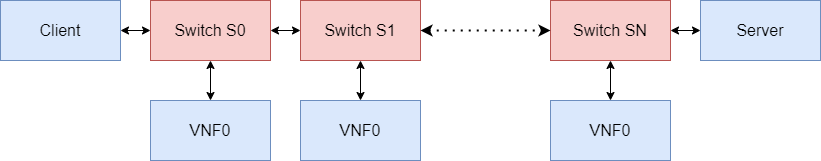
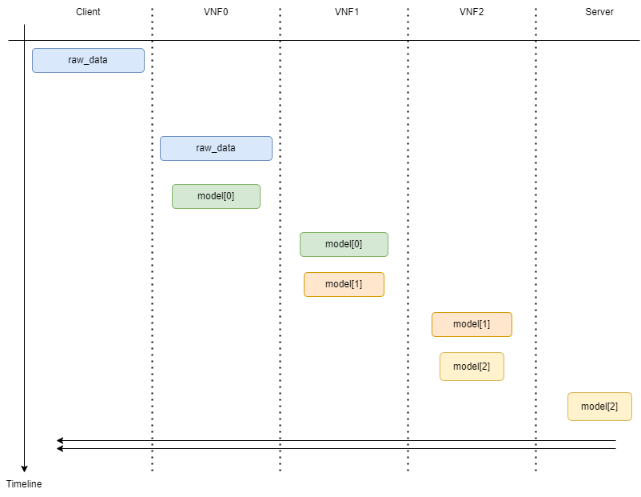
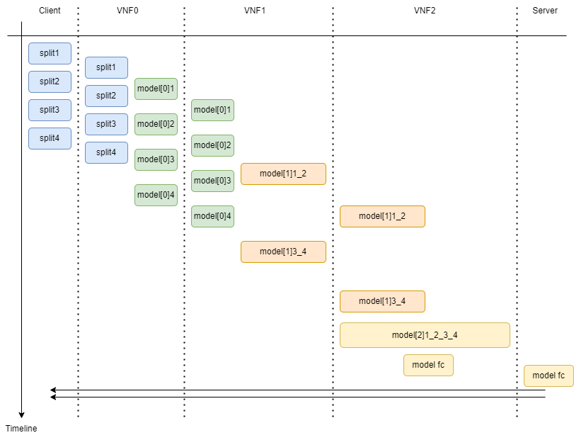
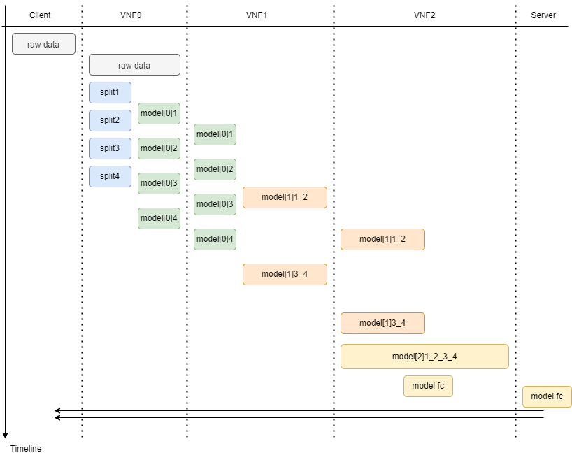
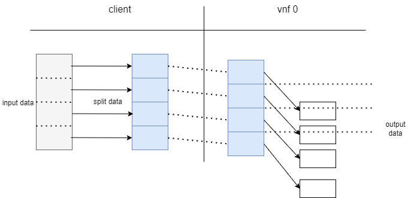
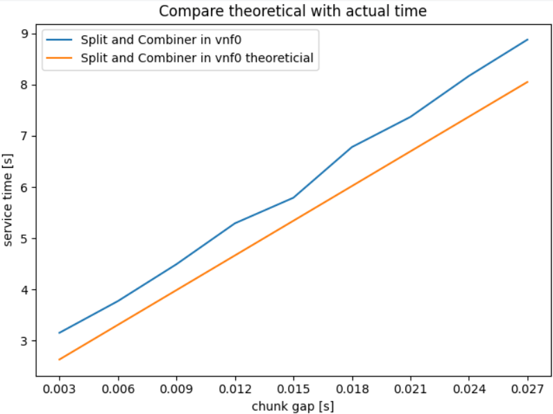
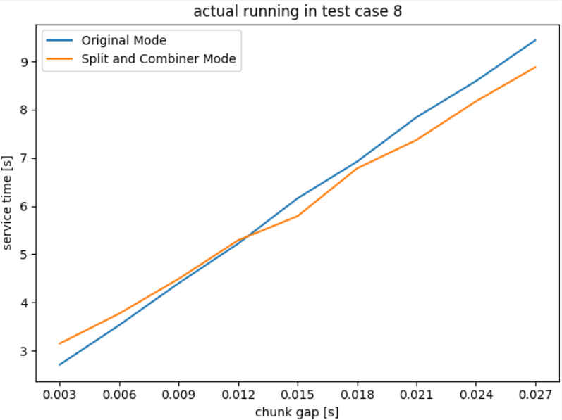

](https://opensource.org/licenses/MIT)


# 1. You Only Hear Once Emulator (Yoho-Emu)


# 2. Table of Contents
- [1. You Only Hear Once Emulator (Yoho-Emu)](#1-you-only-hear-once-emulator-yoho-emu)
- [2. Table of Contents](#2-table-of-contents)
- [3. Description](#3-description)
- [4. Get Started](#4-get-started)
  - [4.1. Installation](#41-installation)
    - [4.1.1. Option1 : Install in a Vagrant managed VM(Highly Recommanded)](#411-option1--install-in-a-vagrant-managed-vmhighly-recommanded)
    - [4.1.2. Option2 : Install in Ubuntu](#412-option2--install-in-ubuntu)
  - [4.2. Run Yoho in the Emulator](#42-run-yoho-in-the-emulator)
    - [4.2.1. Start Emulator](#421-start-emulator)
    - [4.2.2. Measurements](#422-measurements)
- [5. Network Detail](#5-network-detail)
  - [5.1. Calculation Mode](#51-calculation-mode)
    - [5.1.1. Original Mode](#511-original-mode)
    - [5.1.2. Spliter & Combiner](#512-spliter--combiner)
  - [5.2. Performance Test](#52-performance-test)
    - [5.2.1. Theoretical calculation](#521-theoretical-calculation)
    - [5.2.2. Acutal Test](#522-acutal-test)
- [6. Issues Solution](#6-issues-solution)
  - [6.1. Installation Issues](#61-installation-issues)
    - [6.1.1. Network issues for mainland China](#611-network-issues-for-mainland-china)
    - [6.1.2. VScode in Vagrant](#612-vscode-in-vagrant)

# 3. Description
This application emulate the progressive In-Network Processing in the network, it is **based on the [comnetsemu](https://git.comnets.net/public-repo/comnetsemu)**.

Currently, the main branch is the stable version of Yoho V1.0. Other branches are under development for new features.

# 4. Get Started

## 4.1. Installation
There are two ways to install yoho-emu: 

the simpler way is to use the virtual machine we provide, which is based on `vagrant` and will save you some work in environment configuration and can run on any platform.

the other way is to install it directly in ubuntu system, we tested both versions 18.04 and 20.04 and they both work fine.

### 4.1.1. Option1 : Install in a Vagrant managed VM(Highly Recommanded)
1. First [Vagrant](https://www.vagrantup.com/docs/installation) and a VM (we recommend [VirtualBox](https://www.virtualbox.org/wiki/Downloads)) need to be installed.

2. Create the `yoho` VM using Vagrant on your host OS.
    ```bash
    cd ./yoho-emu || exit

    vagrant up yoho
    ```
    Then run `vagrant ssh yoho` to login into the VM. Following steps should be run **inside the VM**.

	```bash
	cd /vagrant
	sudo bash ./build_docker_images.sh
	```   
### 4.1.2. Option2 : Install in Ubuntu
1. First you need to install some basic components:
    ```bash
    # Docker
    sudo apt-get install ca-certificates curl gnupg lsb-release
    curl -fsSL https://download.docker.com/linux/ubuntu/gpg | sudo gpg --dearmor -o /usr/share/keyrings/docker-archive-keyring.gpg
    echo   "deb [arch=$(dpkg --print-architecture) signed-by=/usr/share/keyrings/docker-archive-keyring.gpg] https://download.docker.com/linux/ubuntu \
    $(lsb_release -cs) stable" | sudo tee /etc/apt/sources.list.d/docker.list > /dev/null
    sudo apt-get install docker-ce docker-ce-cli containerd.io docker-compose-plugin
    sudo apt-get install docker-ce=5:20.10.16~3-0~ubuntu-focal docker-ce-cli=5:20.10.16~3-0~ubuntu-focal containerd.io docker-compose-plugin
    sudo apt-get install containerd

    # Ansible
    sudo apt-get install ansible
    pip3 install ansible
    ```

2.  Add docker into user group
    ```bash
    sudo groupadd docker
    sudo gpasswd -a YOUR_USER_NAME docker
    newgrp docker
    sudo systemctl start docker
    ```

3. Install Comnetsemu
   [Comnetsemu](https://git.comnets.net/public-repo/comnetsemu) is a virtual emulator/testbed designed for the book: Computing in Communication Networks: From Theory to Practice (2020)
   ```bash
   # PWD: /YOUR_PATH/yoho-emu
   cd .. && git clone git clone https://git.comnets.net/public-repo/comnetsemu.git
   cd comnetsemu/util
   bash ./install.sh -a
   cd .. || sudo make develop
   ```

4. Install docker image of Yoho
   ```bash
   # PWD: /YOUR_PATH/yoho-emu
   sudo bash ./build_docker_images.sh
   # (Optional) Check Docker image: yoho_dev
   docker image ls
   ```

## 4.2. Run Yoho in the Emulator
### 4.2.1. Start Emulator
Currently we provide a linear network topology, as shown below, each Switch has a corresponding VNF, the switch can forward the data to the VNF for calculation, when the VNF finishes computation, it will send data back to the client.



There are currently two ways to launch Emulator, as follows:
```bash
# PWD: /YOUR_PATH/yoho-emu
# ----------------------- 
# [client] -- [s0] -- [s1] -- [server]
sudo python3 ./topo.py
# [client] -- [s0] -- ...  -- [sn] -- [server]
sudo python3 ./topo_n_vnf.py
```
If you run it successfully, you will enter the `>mininet` command and the script will automatically load the `xterm` shell of each node.
Run Script in each network node.

In the topology, client, vnf and server are all docker containers loaded by comnetsemu. We just need to operate the different nodes in the corresponding shells.

For our yoho-emu, the main tasks are driven by these three python3 scripts.
```bash
    # on the server
    python3 ./server_simple.py

    # on the vnf
    python3 ./vnf_simple.py

    # on the client: origial mode
    usage: client_simple.py [-h] [--epochs EPOCHS]
                            [--test_id {0,1,2,3,4,5,6,7,8,9}] [--is_debug {0,1}]
                            [--chunk_gap CHUNK_GAP]
                            {split} ...

    Client.

    positional arguments:
    {split}               split & combiner mode
        split               split & combiner mode

    optional arguments:
    -h, --help            show this help message and exit
    --epochs EPOCHS       The number of validation epochs.
    --test_id {0,1,2,3,4,5,6,7,8,9}
                            ID of the test case.
    --is_debug {0,1}      if run debug mode
    --chunk_gap CHUNK_GAP
                            dalay for send each chunk [s]
    
    # on the client: spliter and combiner mode
    usage: client_simple.py split [-h] [--id {0,1,2}] [--mode {0,1}]
                              [--epochs EPOCHS]
                              [--test_id {0,1,2,3,4,5,6,7,8,9}]
                              [--is_debug {0,1}] [--chunk_gap CHUNK_GAP]
                              [--s_split S_SPLIT] [--n_split N_SPLIT]
                              [--n_combiner2 N_COMBINER2]
                              [--n_combiner3 N_COMBINER3]

    optional arguments:
    -h, --help            show this help message and exit
    --id {0,1,2}          currently no use !
    --mode {0,1}          [Split in client] = 0, [Split in vnf0] = 1, default 1
    --epochs EPOCHS       The number of validation epochs, default 1
    --test_id {0,1,2,3,4,5,6,7,8,9}
                            ID of the test case, default 8
    --is_debug {0,1}      if run debug mode, default 0
    --chunk_gap CHUNK_GAP
                            delay for send each chunk [s], defalut 0.003
    --s_split S_SPLIT     stride for split, default 256
    --n_split N_SPLIT     number for split, default 4
    --n_combiner2 N_COMBINER2
                            number for combiner2, default 2
    --n_combiner3 N_COMBINER3
                            number for combiner3, defalut 2

```
The client's script provides the split subcommand, which corresponds to the spliter & combiner calculation, we will explain in the [Spliter & Combiner](#4512-spliter--combiner)

### 4.2.2. Measurements
All test data are in `/YOUR_PATH/yoho-emu/emulator_yoho/measurements`，each test case corresponds to a folder, currently we record all result use `w+` mode, if you want to clean all results:

```shell
cd ./emulator_yoho
bash clean_measure.sh
```
We record those data while running:

[Original Mode](#511-original-mode) and [Spliter and Combiner Mode](#512-spliter--combiner)
have different logging content. Some of the debug mode information in [Spliter and Combiner Mode](#512-spliter--combiner) is not available, while the information in release mode is sufficient to understand its specific running time.

- client
```python
'''
[Debug]
    processing_time   :   Data calculate time in client.
    serialize_time    :   serialize send data from torch.array -> bytes
    packet_send_time  :   send all the chunk to next node
    total_time        :   all the time in each epoch

[Release & Debug]
    transmission_time :   send first chunk -> service ack recv all
    service_time      :   send first chunk -> service ack finish calculate
''' 
```
    
- vnf:
for normal situation without spliter & combiner:
```python
'''
[Original]
    [Relase & Debug]
        receive      :  receive all the chunk
        deserialize  :  bytes -> data
        processing   :  using model calculate
        serialize    :  data  -> bytes
        send         :  trans all the chunk
    
    [User Function]  
        @app.func('measure@write_results')
'''
```

for spliter & combiner case, it should be noticed, that we only support case 8 in split & combiner.
```python
'''
[Spliter & Combiner]
    [Debug]
        -------------------- Spliter --------------------------
        sp_receive   :  spliter receive all the chunks
        sp_process   :  spliter processing all the data
        sp_size      :  spliter each size of chunk
        sp_length    :  spliter chunk length
        -------------------- Combiner --------------------------
        cb2_size     :  combiner2 chunk size
        cb2_length   :  combiner2 chunk length
        cb3_fc       :  combiner3 fc processing time
        cb3_size     :  combiner3 chunk size
        cb3_length   :  combiner3 chunk length
    
    [Release & Debug]
        -------------------- Spliter --------------------------
        sp_send      :  spliter send one chunk (time record)
        -------------------- Combiner --------------------------
        cb2_recv     :  combiner2 recv one chunk (time record)
        cb2_process  :  combiner2 process (time record)
        cb2_send     :  cominber2 send one chunk (time record)
        cb3_recv     :  cominber3 recv one chunk (time record)
        cb3_process  :  cominber3 process (time record)
        cb3_send     :  cominber3 send one chunk (time record)
    
    [User Function]
        @app.func('measure@write_results_sc')
```
- server:
we test distance for the result with baseline (original)
```python
distance: [1.1185752153396606, 1.0729272365570068, 5.0812835693359375, 12.173698425292969]
```

For specific data descriptions, please refer to [Network Detail](#43-network-detail)

# 5. Network Detail
## 5.1. Calculation Mode
For a computational task that can be split into 3 parts, we now have two main computational approaches, One is the [Original Mode](#4311-original-mode) which deploys 3 computational parts directly in the network, and the other is the [Spliter & Combiner Mode](#4312-spliter--combiner) which is optimized for computation.

For different deployment methods, our emulator currently does not support arbitrary deployment for arbitrary topologies, but rather a limited number of cases, it is also the `--test_id` option in the `client_simple.py` script, as follows:

- 2 VNF in topo

For 2 VNFs cases, it is recommended to use `topo.py` to start the simulation, please check [Start Emulator](#421-start-emulator).

It should be noted that the topo of 2 VNFs currently only supports [Original Mode](#4311-original-mode), [Spliter & Combiner Mode](#4312-spliter--combiner) are not supported.

| test case id |   client   |   switch 1   |   switch 2   |    server   |
| -------------|:----------:|:------------:|:------------:|:-----------:|
|       0      |    none    |     none     |     none     | model 1 2 3 |
|       1      |  model 1   |     none     |     none     | model 2 3   |
|       2      |  model 1 2 |     none     |     none     | model 3     |
|       3      | model 1 2 3|     none     |     none     |     none    |
|       4      |  model 1   |     none     |     none     | model 2 3   |
|       5      |  model 1   |    model 2   |     none     | model 3     |
|       6      |  model 1   |    model 2   |     model 3  |     none    |
|       7      |    none    |   model 1 2  |     model 3  |     none    |


- 3 VNF in topo

For the case of 3 VNFs, you need to start the emulator via `topo_n_vnf.py`, please check [Start Emulator](#421-start-emulator)

Origial Mode both test cases are supported, Spliter & Cominber only support `test_case 8`.

| test case id |   client   |   switch 1   |   switch 2   |    switch3   |    server   |
| -------------|:----------:|:------------:|:------------:|:------------:|:-----------:|
|       8      |     none   |    model 1   |    model 2   |     model 3  |     none    |
|       9      |     none   |     none     |     none     |      none    | model 1 2 3 |

### 5.1.1. Original Mode
Original Mode is to not do anything with these three computational parts and deploy them directly on our nodes, for example, the original model for test_case 8 is as follow:


### 5.1.2. Spliter & Combiner
In [Original Mode](#4311-original-mode), the computed data of the next node needs to wait for the previous node to finish the computation and fully transfer before it can be computed. Spliter & Combiner Mode splits the computed part1, thus reducing the waiting time and improving the performance. 

We build two modes of split mode, one is **split in client**, other one is **split in vnf 0**, the mainly difference is the data split. 

You can control this by setting the `--mode`, see `client_simple.py split` [instructions](#421-start-emulator).

In **split in client**, we split the data in `n_split` part, then send each part to vnf0 one by one. The situation when `n_split = 4` is shown in the figure below.



In **split in vnf0**, we send all the raw data directly to vnf0, then run `split_and_compute()`.

The situation when `n_split = 4` is shown in the figure below.




## 5.2. Performance Test
It is important to note that different CPU performance will affect the values of the test results. 
The CPU information `/proc/cpuinfo` on which the test data in this document is based is as follows:
```shell
processor       : 0
model name      : Intel(R) Xeon(R) Gold 6133 CPU @ 2.50GHz
cpu cores       : 2
cpu MHz         : 2494.140
cache size      : 28160 KB

model name      : Intel(R) Xeon(R) Gold 6133 CPU @ 2.50GHz
processor       : 1
cpu cores       : 2
cpu MHz         : 2494.140
cache size      : 28160 KB
```

The memory information is as follows:
```bash
free -m
# results:
              total        used        free      shared  buff/cache   available
Mem:           3419         552         570           2        2296        2571
Swap:          4095           0        4095
```
We use a 4s-length audio mix as the test raw data with a sampling rate of 16000Hz, so `length = 64000` in the script.

### 5.2.1. Theoretical calculation
To facilitate comparison with [Spliter and Combiner Mode](#512-spliter--combiner), we will analyze the network topology and deployment method with `test_case 8`.

- [Origial Mode](#511-original-mode)

In original mode, since there is no parallelism in the computation process, `service_time` is the `process_time` of each node, plus the transmission time of each chunk, and the `serialize` and `deserialize` time can be ignored compared to the total sum of `chunk_gap`. Since there is no processing part on the service, the service can return the result directly after receiving all the data, and the `service time` is equal to the `transmisson time`.

The chunk transfer time per $node$ is roughly the number of send chunks $n_{chunk,node}$ multiplied by the number of chunks transferred per chunk_gap $t_{chunk\_gap}$.

Let the process time of the three computation parts be $t_{p1},t_{p2},t_{p3}$ respectively.

Then the total transmission time $t_{trans}$ is the sum of the parts:

$$ t_{trans} = n_{chunk,client} \times t_{chunk\_gap} + \sum_{i=0}^{2} (n_{chunk,vnf_i} \times t_{chunk\_gap}+t_{p(i+1)}) $$

With our current hardware configuration and input signals, the relevant time information is as follows:

The number of transmitted data chunks per node in this mode:
```shell
- client:
        send chunks lens: 185
- vnf 0:  
        send chunks lens: 47
- vnf 1:     
        send chunks lens: 3
- vnf 2:
        send chunks lens: 14
```
The processing time on this machine is as follows:
```python
*** running model: 1 out of 3 !
*** part 1 time: 0.9877066612243652
*** running model: 2 out of 3 !
*** part 2 time: 0.824944257736206
*** running model: 3 out of 3 !
*** part 3 time: 0.48497653007507324
*** total part time : 2.2976274490356445
```
So the final `service time` is:
$$ t_{serv} = t_{trans} = 2.30 + (185+47+31+14) \times t_{chunk\_gap} = 2.30 + 277 \times t_{chunk\_gap}$$


- [Spliter & Combiner Mode](#512-spliter--combiner)

For split mode, we only need to pay attention to the time when the last chunk reaches vnf2.

The processing time of the spliter model is as follows:
```python
# split
4 split time: 1.089,   each split: 0.272,                t_part1/4 = 0.246, ratio = 1.102
combiner2 time: 0.914, each combiner: 0.457308292388916, t_part2/2 = 0.412, ratio = 1.108
combiner3 time: 0.410, each combiner: 0.410172700881958, t_part3   = 0.484, ratio = 0.845
split & combiner total time: 2.4138119220733643
```
In terms of processing time, [Spliter and Combiner Mode](#512-spliter--combiner) is not much larger than [Original Mode](#511-original-mode)

- Split in client:

```bash
- clinet:
    send chunks lens: 103 * 4
- vnf0:
    send chunks lens: 12, 12, 12, 12
- vnf1:
    send chunks lens: 15, 15
- vnf2:
    send chunks len: 14
```
the final service time:
$$ t_{serv} = t_{trans} =  453 \times t_{chunk\_gap} + t_{split} \div 4 + t_{combiner2} \div 2 + t_{combiner3} = 1.13 + 453 \times t_{chunk\_gap} $$

- Split in vnf0:
Compared to **Split in client**, we save $n_{chunk,client}$, but the process time t_{p1} is 4 times longer than time of **Split in client**.
$$ t_{serv} = t_{trans} = 226 \times t_{chunk\_gap} + t_{split} + t_{combiner2} \div 2+ t_{combiner3} = 1.95 + 226 \times t_{chunk\_gap} $$

In fact, in the program run, if the $t_{chunk\_gap}$ is too small, then the 4 split part data will arrive in vnf 0 almost at the same time, and vnf 0 needs to run multiple split parts at the same time, so it will cause the problem of longer processing time. We prefer **Split in vnf Mode**, although the theoretical performance is not the best, but it seems to be more stable at present.



### 5.2.2. Acutal Test
We test different $t_{chunk\_gap}$, first we check the theoretical correctness, and finally we give the performance comparison of different modes.

- [Original Mode](#511-original-mode)


- [Spliter and Combiner Mode](#512-spliter--combiner)



From the figure, we can see that there is only **process time** error between our theoretical analysis and the actual result, therefore, it is still possible to **get the idea of subsequent improvement from the [theoretical calculation](#521-theoretical-calculation)**

In the actual comparison of the two modes, we can also see that in the case of poor network environment, we will have better results because [Spliter and Combiner Mode](#512-spliter--combiner) can reduce the network overhead.



# 6. Issues Solution
## 6.1. Installation Issues
### 6.1.1. Network issues for mainland China
Mainland China has poor support for official `ubuntu` sources and `pip` sources.
We have prepared some files for this, you only need to make some simple changes to complete the source replacement to complete the installation successfully.

```shell
# ubuntu source
/YOUR_PATH/yoho-emu/sources.list

# pip & pip3
/YOUR_PATH/yoho-emu/pip.conf pip3.conf

# Vagrantfile & Dockerfile.yoho_env
# edit file base on comment
```

### 6.1.2. VScode in Vagrant

1. Get SSH configuration:

    ```bash
    vagrant ssh-config
    ```
2. Copy output to Remote-SSH config file.

3. Login in yoho in Remote SSH and Set XServer:
   
   - Download one XServer Application, we recommand `MobaXterm`, Remote-X11 extension may be also okay!
   - Next following step is base on `MobaXterm`.
   - In `MobaXterm` : change default path to your repo dictionary, in `Setting` --> `Configuration` --> `General` --> `Persisant Home Dictionary`
   - Restart `MobaXterm`
   - In `MobaXterm` : click `start local termal` and run `vagrant ssh yoho` in the new shell, which should succcessfully run `vagrant up yoho` before.
   - In `MobaXterm` : if successfully login, check the login header info to find the `Last Login` IP, like `10.0.2.2`
   - In `MobaXterm` : run `echo $DISPLAY`, check the offset number, default is `10:0`
   - In `MobaXterm` : run `export DISPLAY=10.0.2.2:10.0`, `10:0.2.2:10.0` is the ip and offset in last 2 steps, you can also add this command in `~/.bashrc` if you like :)
   - Login in VsCode by Remote-SSH, run `xclock` to check if GUI is showing.
